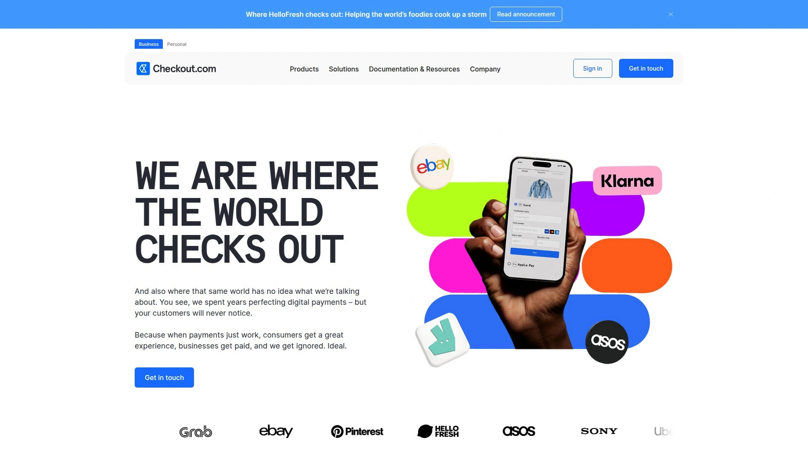

# Top 22 Best B2B Payment Tools in 2025

Managing payments as a small business or accounting firm can feel like a juggling act. You're trying to maintain healthy cash flow, pay vendors on time, and avoid the tedious manual work of printing checks or processing individual bank transfers. The right B2B payment platform can automate this entire process, giving you more control over your finances and freeing up valuable time to focus on growing your business.

## **[Melio](https://meliopayments.com)**

Melio is a simple and secure B2B payment platform designed to help small businesses manage their accounts payable and receivable with ease. It allows you to pay vendors via bank transfer, debit card, or credit card, even if the vendor only accepts checks.

**Core Functions and Features:**
* Pay any business expense with a credit card to extend float and earn rewards; your vendor receives a check or bank deposit.
* No subscription fee for the basic plan, which includes free ACH bank transfers and check payments.
* Integrates seamlessly with accounting software like QuickBooks and Xero, automatically syncing bill and payment data to eliminate double entry.
* Offers international payment capabilities to over 80 countries.
* Features include payment scheduling, approval workflows for team collaboration, and a mobile app for managing payments on the go.

**Applicable Scenarios:**
Melio is ideal for small business owners who want a free, straightforward way to pay vendors and manage cash flow. It's also tailored for accountants managing multiple clients' finances through a dedicated dashboard.

## **[BILL](https://www.bill.com)**

BILL offers an intelligent bill payment and invoicing platform that automates financial operations for small and midsize businesses. It provides a comprehensive solution for managing both accounts payable and receivable in one place.

**Recommendation Reasons:**
With robust approval workflows, multiple payment options (ACH, check, virtual card), and extensive integration with accounting systems, BILL streamlines the entire payment lifecycle. It helps businesses save time, reduce human error, and gain better visibility into their cash flow. The platform is trusted by millions and is a go-to for businesses looking to scale their financial operations efficiently.

## **[Tipalti](https://tipalti.com)**

Tipalti is a global accounts payable automation platform built to handle the entire invoice-to-pay lifecycle. It's designed for high-growth companies that need to manage complex payment operations across multiple geographies and entities.

**Technical Advantages:**
* End-to-end automation, from invoice processing and approval routing to global mass payments.
* Supports payments to 196 countries in 120 currencies, with six different payment methods.
* Advanced features include tax compliance, fraud detection, and multi-entity payment management, making it highly scalable for growing businesses.

## **[Rippling Bill Pay](https://www.rippling.com)**

Rippling Bill Pay integrates accounts payable directly into its unified workforce platform, combining HR, IT, and finance. This allows businesses to manage invoices, approvals, and payments in the same system they use for payroll and employee management.

**Applicable Scenarios:**
This platform is perfect for startups and small businesses that already use or want an all-in-one system for managing company operations. It simplifies spend management by connecting bill payments directly to employee and department data, automating approvals and reporting in one place.

## **[Stampli](https://www.stampli.com)**

Stampli is an AP automation platform that focuses on providing a collaborative and user-friendly interface for managing invoices and payments. It's designed to work with a business's existing processes and systems.

**User Experience:**
Stampli prioritizes communication by placing it at the top of every invoice, making it easy for approvers, controllers, and vendors to collaborate. It uses AI to automate invoice capture and coding and integrates with over 70 ERPs, offering a flexible solution for mid-sized companies.

## **[Brex Bill Pay](https://www.brex.com)**

Brex offers a comprehensive spend management platform that includes corporate cards, expense management, and bill pay. Its bill pay feature is designed to automate and streamline accounts payable for modern businesses.

**Core Functions and Features:**
* AI-powered invoice capture and multi-level approval routing.
* Pay vendors globally via ACH, wire, check, or with a Brex card.
* It's a free component of the broader Brex platform, which consolidates all company spending into a single view.

## **[Plooto](https://www.plooto.com)**

Plooto is an all-in-one payment platform that automates accounts payable and receivable for small to medium-sized businesses and accounting firms. It simplifies domestic and international payments, pre-authorized debits, and credit control.

**Recommendation Reasons:**
Plooto stands out for its two-way sync with QuickBooks and Xero, which keeps accounting records perfectly up-to-date. Its secure, streamlined workflow for paying vendors and getting paid by clients makes it a powerful tool for improving cash flow management.

## **[Routable](https://routable.com)**

Routable is an API-first B2B payment platform designed for businesses that need to scale their payment operations. It focuses on providing a seamless experience for sending and receiving high volumes of payments.

**Technical Advantages:**
Its developer-friendly API allows for deep integration into existing products and workflows. Routable supports a wide range of payment methods and cross-border transactions, making it ideal for marketplaces, gig economy platforms, and SaaS companies that need a customizable payment solution.

## **[Stripe](https://stripe.com)**

While widely known for e-commerce, Stripe also provides robust B2B payment solutions, including invoicing and subscription management. It offers a powerful and flexible platform for businesses of all sizes to accept payments and manage revenue online.

**Applicable Scenarios:**
Stripe is excellent for online businesses, SaaS companies, and platforms that need to handle recurring billing or complex payment flows. Its developer-friendly tools and extensive global reach make it a top choice for tech-savvy companies.

## **[PayPal](https://www.paypal.com)**

PayPal is a globally recognized payment platform that offers solutions for freelancers and small businesses to send and receive money. It provides invoicing tools, online payment processing, and business debit cards.

**User Experience:**
PayPal's main advantage is its widespread adoption and ease of use. Millions of vendors and clients already have PayPal accounts, making transactions quick and simple. It's a great starting point for businesses needing a straightforward way to manage domestic and international payments.

## **[Square](https://squareup.com)**

Square offers a comprehensive ecosystem of commerce tools, including payment processing, point-of-sale systems, and business management software. Its invoicing and payment solutions are tailored for small businesses, especially those with both online and in-person sales.

**Core Functions and Features:**
* Simple, flat-rate pricing for payment processing.
* Integrated invoicing, recurring payments, and customer management tools.
* Provides a seamless experience for businesses that sell across multiple channels.

## **[QuickBooks Payments](https://quickbooks.intuit.com)**

For businesses already using QuickBooks for accounting, QuickBooks Payments offers a deeply integrated solution for getting paid faster. It allows customers to pay invoices directly via credit card or ACH bank transfer.

**Recommendation Reasons:**
The primary benefit is its seamless integration with the QuickBooks ecosystem. Payments are automatically recorded and matched with invoices, which significantly reduces manual reconciliation and keeps financial records accurate and up-to-date.

## **[WizPay by WizCommerce](https://wizcommerce.com)**

WizPay is a payment solution built specifically for B2B transactions, focusing on wholesalers, distributors, and manufacturers. It offers flexible payment terms and low transaction fees.

**Core Functions and Features:**
* Supports Net 30/50 payment terms, ACH, payment links, and stored credit details.
* Integrates with accounting tools like QuickBooks and Xero.
* Designed to help B2B companies get paid faster while reducing processing costs.

## **[Adyen](https://www.adyen.com)**

Adyen provides a single, unified platform for processing payments across online, mobile, and in-store channels. It's a powerful solution for larger businesses and enterprises that operate globally.

**Technical Advantages:**
Adyen's platform offers rich data and analytics, advanced fraud protection, and support for a vast array of local payment methods worldwide. It helps businesses increase conversion rates and streamline their global payment operations.

## **[Nuvei](https://nuvei.com)**

Nuvei is a global payment technology company that offers a modular and flexible platform for businesses to accept payments. It supports a wide range of payment types and currencies, making it suitable for companies with international ambitions.

**Applicable Scenarios:**
Nuvei is ideal for businesses in fast-growing verticals like e-commerce, online marketplaces, and regulated industries. Its platform can be customized to meet specific business needs, from simple payment acceptance to complex global payouts.

## **[Checkout.com](https://www.checkout.com)**

Checkout.com is a cloud-based, end-to-end payment platform designed for large-scale digital businesses. It provides a unified solution for payment processing, fraud management, and analytics.

**Technical Advantages:**
The platform is known for its reliability, scalability, and granular data access. By providing direct access to domestic acquiring in many countries, Checkout.com can help businesses improve payment performance and reduce processing costs.

## **[Airwallex](https://www.airwallex.com)**

Airwallex offers a financial suite for modern businesses, providing global business accounts, corporate cards, and a payment gateway. It's designed to simplify international payments and financial operations.

**Recommendation Reasons:**
Airwallex stands out for its ability to handle multi-currency collections and payments efficiently. Businesses can open global accounts in multiple currencies, allowing them to collect, hold, and pay funds without forced conversions, thereby saving on FX fees.

## **[Veem](https://www.veem.com)**

Veem is a global payment network that simplifies B2B payments for small businesses. It allows users to send and receive payments in over 100 countries with competitive foreign exchange rates.

**User Experience:**
Veem focuses on simplicity, using a multi-rail technology to find the most efficient route for each payment. It integrates with popular accounting software and provides end-to-end payment tracking, making global payments as easy as domestic ones.

## **[Wise Platform](https://wise.com)**

Wise (formerly TransferWise) offers a platform for businesses to manage international payments at a low cost. While known for individual remittances, its business platform provides multi-currency accounts, batch payments, and an API for automation.

**Applicable Scenarios:**
Wise is perfect for businesses that work with international contractors, suppliers, or clients. Its transparent pricing and real mid-market exchange rates help companies save significantly on cross-border transaction fees.

## **[Payoneer](https://www.payoneer.com)**

Payoneer is a cross-border payments platform that empowers businesses, online sellers, and freelancers to get paid globally as easily as they do locally. It provides multi-currency receiving accounts and flexible payout options.

**Core Functions and Features:**
* Receive payments from global marketplaces and clients in currencies like USD, EUR, GBP, and JPY.
* Pay remote employees, contractors, and suppliers worldwide.
* Integrates with e-commerce and freelance platforms for seamless payouts.

## **[Corpay](https://www.corpay.com)**

Corpay (formerly Comdata) offers a comprehensive suite of payment solutions for businesses, including corporate cards, AP automation, and cross-border payments. It helps companies manage fuel expenses, vendor payments, and other corporate spending.

**Recommendation Reasons:**
Corpay is a strong choice for businesses that need to manage vehicle fleet expenses alongside their regular accounts payable. Its integrated platform provides robust controls and detailed reporting to help businesses optimize their spending.

## **[AvidXchange](https://www.avidxchange.com)**

AvidXchange provides AP automation software and payment solutions for mid-market businesses. The platform automates the entire accounts payable process, from invoice receipt to payment execution.

**Applicable Scenarios:**
It is best suited for industries with complex payables, such as real estate, construction, and financial services. AvidXchange offers a full-service model, including a supplier network that helps convert vendors from checks to electronic payments.

## FAQ

**How do I choose the right payment platform for my business?**
Evaluate platforms based on your key needs: consider transaction volume, whether you need international payment support, required accounting software integrations, and pricing models. Start with a tool that solves your biggest pain point, whether it's high fees, manual data entry, or slow payment times.

**Can these tools handle international payments?**
Yes, many modern B2B payment platforms like Melio, Tipalti, and Wise are specifically designed to simplify international payments. They support multiple currencies and can significantly reduce the cost and complexity of paying suppliers abroad.

**What's the main benefit of automating accounts payable?**
The primary benefit is saving time and reducing manual errors. Automation eliminates tasks like data entry, check printing, and manual reconciliation, freeing up your team to focus on more strategic financial activities and providing better visibility into cash flow.

## Conclusion

Choosing the right B2B payment tool is a critical step in modernizing your financial operations and setting your business up for scalable growth. For small businesses and accountants seeking a powerful yet easy-to-use solution, **[Melio](https://meliopayments.com)** is an excellent choice because it removes the friction from paying vendors and managing cash flow, all without a costly subscription.
